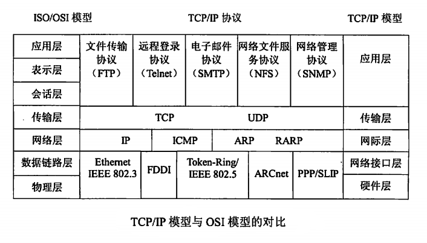

## 网络技术基础

### OSI分层(7层)
- 物理层
- 数据链路层
- 网络层
- 传输层
- 会话层
- 表示层
- 应用层

### TCP/IP分层(4层)
- 网络接口层
- 网络层
- 运输层
- 应用层

### 五层协议

- 物理层
- 数据链路层
- 网络层
- 运输层
- 应用层

### IP地址计算

### reference
https://www.nowcoder.com/ta/review-network